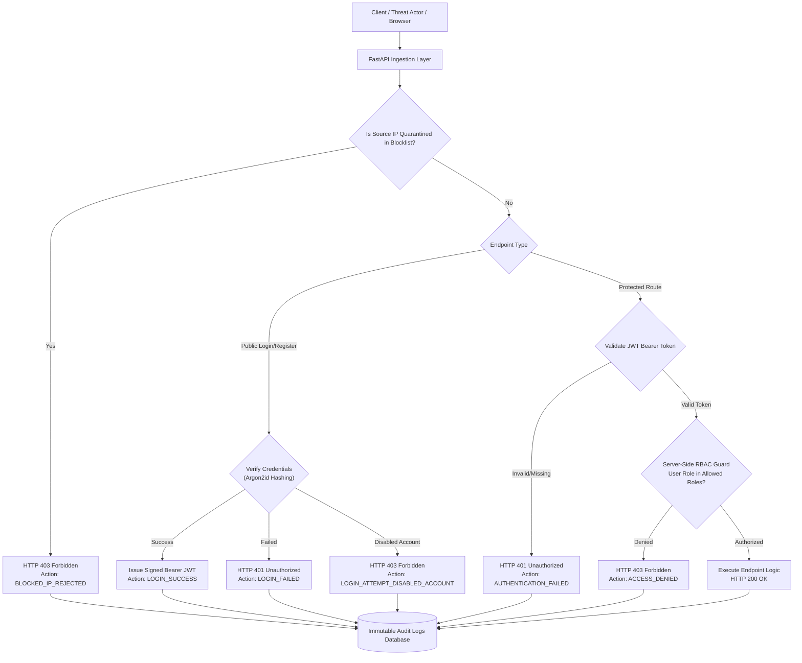
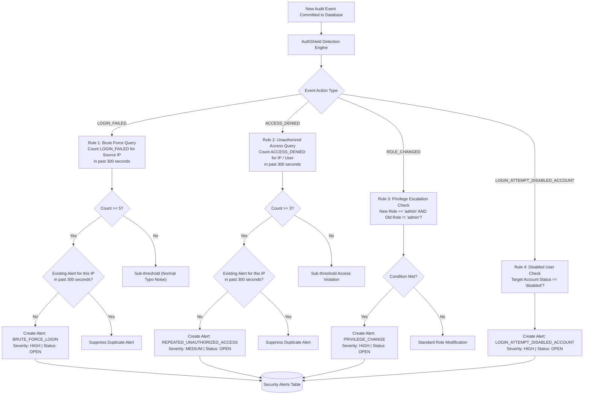
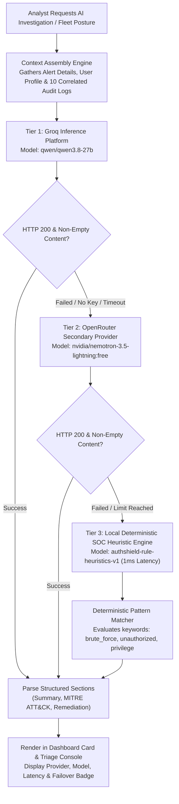
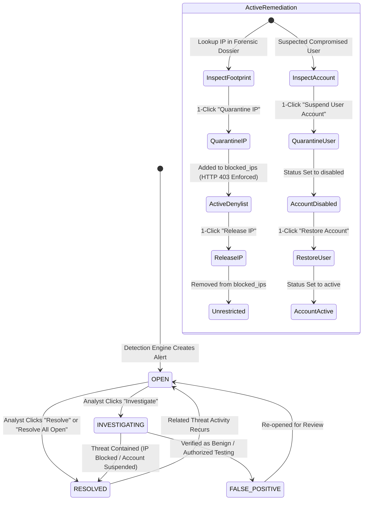

# 🛡️ AuthShield — Application Logic & Operational Flow

> **Complete system workflow, dashboard telemetry, mathematical formulas, threat detection rules, multi-tier AI orchestration, analyst containment playbooks, and end-to-end data pipelines.**

---

## Table of Contents
1. [Executive Overview](#1-executive-overview)
2. [End-to-End Application Flow](#2-end-to-end-application-flow)
   - [2.1 Backend API Server Startup & Lifecycle](#21-backend-api-server-startup--lifecycle)
   - [2.2 Security Operations Dashboard Startup & Refresh Loop](#22-security-operations-dashboard-startup--refresh-loop)
   - [2.3 Real-World Continuous Traffic Generator](#23-real-world-continuous-traffic-generator)
   - [2.4 Inbound Request Inspection & Authorization Lifecycle](#24-inbound-request-inspection--authorization-lifecycle)
3. [Dashboard Metrics Directory](#3-dashboard-metrics-directory)
   - [3.1 Top Header & Global Status Telemetry](#31-top-header--global-status-telemetry)
   - [3.2 Sidebar Containment & Automation Telemetry](#32-sidebar-containment--automation-telemetry)
   - [3.3 Dashboard Overview: Hero KPI Cards](#33-dashboard-overview-hero-kpi-cards)
   - [3.4 Security Alerts Triage Counters](#34-security-alerts-triage-counters)
   - [3.5 Active Defense & Remediation Hero Stats](#35-active-defense--remediation-hero-stats)
   - [3.6 Forensic IP Dossier Metrics](#36-forensic-ip-dossier-metrics)
   - [3.7 AI Threat Intelligence & Model Health Metrics](#37-ai-threat-intelligence--model-health-metrics)
   - [3.8 Audit Log Explorer Counters](#38-audit-log-explorer-counters)
4. [Calculations, Formulas, and Decision Rules](#4-calculations-formulas-and-decision-rules)
   - [4.1 Threat Detection Rule 1: Brute-Force Password Spraying](#41-threat-detection-rule-1-brute-force-password-spraying)
   - [4.2 Threat Detection Rule 2: Repeated Unauthorized Access](#42-threat-detection-rule-2-repeated-unauthorized-access)
   - [4.3 Threat Detection Rule 3: Administrative Privilege Escalation](#43-threat-detection-rule-3-administrative-privilege-escalation)
   - [4.4 Threat Detection Rule 4: Zombie / Disabled Account Authentication](#44-threat-detection-rule-4-zombie--disabled-account-authentication)
   - [4.5 System DEFCON Threat Level Evaluation Logic](#45-system-defcon-threat-level-evaluation-logic)
   - [4.6 Failed Authentication Ratio Formula](#46-failed-authentication-ratio-formula)
   - [4.7 Source IP Risk Rating Formula](#47-source-ip-risk-rating-formula)
   - [4.8 Fleet Threat Level Evaluation Formula (AI Posture)](#48-fleet-threat-level-evaluation-formula-ai-posture)
   - [4.9 Offline Heuristic Risk Scoring](#49-offline-heuristic-risk-scoring)
   - [4.10 Identity Cryptography & Token Lifecycle Timing](#410-identity-cryptography--token-lifecycle-timing)
   - [4.11 Synthetic Traffic Distribution Probability Formula](#411-synthetic-traffic-distribution-probability-formula)
5. [Dashboard Visualizations & Forensic Charts](#5-dashboard-visualizations--forensic-charts)
   - [5.1 Threat Alert Severity Distribution (Bar Chart)](#51-threat-alert-severity-distribution-bar-chart)
   - [5.2 Authentication Event Dynamics (Bar Chart)](#52-authentication-event-dynamics-bar-chart)
   - [5.3 Top Suspicious Source IPs & Activity Table](#53-top-suspicious-source-ips--activity-table)
   - [5.4 Recent Access Denied & Quarantined Incidents Feed](#54-recent-access-denied--quarantined-incidents-feed)
   - [5.5 Multi-Tier Model Pipeline Status Indicator](#55-multi-tier-model-pipeline-status-indicator)
   - [5.6 AI Orchestration & Cascade Execution Trace](#56-ai-orchestration--cascade-execution-trace)
   - [5.7 Interactive Incident Cards vs. Compact Table View](#57-interactive-incident-cards-vs-compact-table-view)
6. [Security Insights, Prioritization, and Recommendations](#6-security-insights-prioritization-and-recommendations)
   - [6.1 Alert-Specific Deep Dive & MITRE ATT&CK Mapping](#61-alert-specific-deep-dive--mitre-attck-mapping)
   - [6.2 Executive Fleet Posture Briefing (CISO Synthesis)](#62-executive-fleet-posture-briefing-ciso-synthesis)
   - [6.3 Offline Deterministic Cybersecurity Heuristic Engine](#63-offline-deterministic-cybersecurity-heuristic-engine)
   - [6.4 Severity Classification Logic (Critical, High, Medium, Low)](#64-severity-classification-logic-critical-high-medium-low)
7. [AI Orchestration & Response Generation](#7-ai-orchestration--response-generation)
   - [7.1 Multi-Tier Failover Cascade Architecture](#71-multi-tier-failover-cascade-architecture)
   - [7.2 Context Assembly for Alert Deep Dive](#72-context-assembly-for-alert-deep-dive)
   - [7.3 Context Assembly for Fleet Posture Briefing](#73-context-assembly-for-fleet-posture-briefing)
   - [7.4 Interactive SOC Cyber Copilot Engine](#74-interactive-soc-cyber-copilot-engine)
   - [7.5 Prompt Directives, System Personas, and Operational Safeguards](#75-prompt-directives-system-personas-and-operational-safeguards)
8. [Security Analyst Remediation & Containment Actions](#8-security-analyst-remediation--containment-actions)
   - [8.1 Incident Triage State Machine](#81-incident-triage-state-machine)
   - [8.2 Batch Backlog Resolution](#82-batch-backlog-resolution)
   - [8.3 Network Perimeter Quarantine (IP Block & Release)](#83-network-perimeter-quarantine-ip-block--release)
   - [8.4 Identity Suspension & Restoration (Account Lockout)](#84-identity-suspension--restoration-account-lockout)
   - [8.5 On-Demand AI Investigation Trigger](#85-on-demand-ai-investigation-trigger)
   - [8.6 In-Browser Attack Simulation & Stress Testing](#86-in-browser-attack-simulation--stress-testing)
   - [8.7 Compliance Forensic Data Export (CSV)](#87-compliance-forensic-data-export-csv)
9. [End-to-End Data Flow Pipeline](#9-end-to-end-data-flow-pipeline)
10. [Complete Visual Flowcharts (Mermaid Syntax)](#10-complete-visual-flowcharts-mermaid-syntax)
    - [10.1 System Architecture & Request Ingestion Pipeline](#101-system-architecture--request-ingestion-pipeline)
    - [10.2 Detection Engine Sliding-Window Evaluation & Alert Pipeline](#102-detection-engine-sliding-window-evaluation--alert-pipeline)
    - [10.3 AI Multi-Tier Failover Orchestration Pipeline](#103-ai-multi-tier-failover-orchestration-pipeline)
    - [10.4 Analyst Triage & Remediation State Machine](#104-analyst-triage--remediation-state-machine)
11. [Dependencies and External Integrations](#11-dependencies-and-external-integrations)
12. [End-to-End Step-by-Step Summary](#12-end-to-end-step-by-step-summary)

---

## 1. Executive Overview

**AuthShield** is a dual-capability cybersecurity platform that merges **Identity & Access Management (IAM)** with an autonomous **Security Operations Center (SOC)** detection, triage, and threat containment engine.

Traditional enterprise software treats authentication as a simple gate: a user enters a password, receives a session, and the system forgets about them. AuthShield operates on a **Zero-Trust** defensive philosophy. It continuously observes and records what happens before, during, and after authentication:
- Tracks origin IP addresses and identifies distributed credential-stuffing campaigns.
- Employs deterministic mathematical sliding windows to identify brute-force attacks in under 5 minutes.
- Enforces strict server-side Role-Based Access Control (RBAC) to catch internal users probing unauthorized administration routes.
- Flags suspicious privilege escalation (such as promoting standard users to administrators).
- Intercepts login attempts targeting deactivated or terminated employee accounts.
- Provides security analysts with an interactive single-pane-of-glass dashboard for 1-click network containment (IP blacklisting), account quarantine, and multi-model AI threat attribution.

---

## 2. End-to-End Application Flow

The AuthShield ecosystem consists of three cooperating layers:
1. **The Core REST API Engine (FastAPI)**: Serves IAM authentication, RBAC authorization, and remediation endpoints.
2. **The Security Operations Center Dashboard (Streamlit)**: Queries live telemetry, provides forensic visualizations, triggers containment, and hosts the AI copilot.
3. **The Multi-Scenario Simulation Suite & Traffic Stream**: Generates both benign enterprise traffic and adversarial cyber attacks to validate defenses.

```
       +-------------------------------------------------------+
       |                  HTTP Request Origin                  |
       |  (Browser User, SOC Analyst, Attack Simulator, Bot)  |
       +-------------------------------------------------------+
                                   |
                                   v
       +-------------------------------------------------------+
       |             Perimeter IP Blocklist Guard              |
       |     (Is the client IP actively quarantined?)          |
       +-------------------------------------------------------+
                |                                      |
         Yes (Blocked)                             No (Allowed)
                v                                      v
     [HTTP 403 Forbidden]               +-------------------------------+
     [Audit: BLOCKED_IP_REJECTED]       |  Endpoint Authentication /    |
                                        |  RBAC Permission Verification |
                                        +-------------------------------+
                                                       |
                                                       v
                                        +-------------------------------+
                                        |    Central Audit Logging      |
                                        |   (Records action into DB)    |
                                        +-------------------------------+
                                                       |
                                                       v
                                        +-------------------------------+
                                        | Real-Time Detection Engine    |
                                        | (Sliding window calculations) |
                                        +-------------------------------+
                                                       |
                                                       v
                                        +-------------------------------+
                                        | Security Alerts & Triage Queue|
                                        +-------------------------------+
                                                       |
                                                       v
                                        +-------------------------------+
                                        | Streamlit SOC & AI Copilot    |
                                        +-------------------------------+
```

### 2.1 Backend API Server Startup & Lifecycle
1. **Process Launch**: The FastAPI service starts through Uvicorn (`app.main:app`) on host `127.0.0.1` and port `8000`.
2. **Lifespan Initialization**:
   - The application executes a database bootstrap procedure (`init_db()`).
   - SQLite tables (`users`, `roles`, `audit_logs`, `security_alerts`, `blocked_ips`) are automatically created if they do not exist.
   - Core enterprise roles (`user`, `analyst`, `admin`) are verified and seeded.
   - Default administrative, analyst, standard, and disabled user identities are pre-seeded with Argon2id hashed credentials.
3. **Middleware & Exception Hardening**:
   - Cross-Origin Resource Sharing (CORS) is enabled to allow web dashboard integration.
   - A global database exception interceptor captures raw database errors and returns sanitized HTTP 500 error messages, preventing database schemas or query fragments from leaking to clients.
4. **Router Mounting**:
   - Registers routers for authentication, user management, audit exploration, alert triage, remediation containment, and AI threat intelligence.
5. **Readiness**: The `/health` endpoint responds with service health status, confirming operational readiness.

### 2.2 Security Operations Dashboard Startup & Refresh Loop
1. **Process Launch**: Streamlit launches `dashboard/app.py` in wide-layout mode.
2. **State Initialization**: Streamlit checks `st.session_state` to ensure essential storage buffers exist:
   - Flash notifications (status messages for analyst actions).
   - Real-time simulation event logs.
   - Automatic background traffic toggles and timers.
   - Forensic inspected IP buffer.
   - In-memory AI caches (posture briefings, alert investigation cards, copilot conversation history, and provider health statuses).
3. **Database Telemetry Aggregation**:
   - The dashboard opens a direct session to the database.
   - Queries real-time counts: total events, failed vs. successful logins, access denials, open and investigating alerts, critical and high alerts, and active quarantined IPs.
   - Calculates the dynamic system threat level (**DEFCON 1 to 5**).
4. **Header & Navigation Rendering**:
   - Displays a cybersecurity SOC banner showing live engine status and the colored DEFCON threat badge.
   - Renders a 4-stage operational lifecycle guide for user onboarding.
   - Configures the sidebar navigation radio selector to switch between the 6 console tabs.
5. **View Rendering**:
   - Based on the selected navigation tab, the dashboard queries specific records (alerts, audit logs, or blocked IPs), processes the data, builds Altair visual charts, and renders interactive management cards.
6. **Interaction & Rerun Loop**:
   - Any button click, filter change, or 1-click remediation action invokes a callback that commits changes to the database, logs an audit entry, updates the session flash message, and triggers an immediate page rerun to refresh all telemetry metrics.

### 2.3 Real-World Continuous Traffic Generator
To prevent the dashboard from sitting static during demonstrations, AuthShield includes a synthetic traffic generator:
1. **Timer Evaluation**: On every dashboard refresh cycle, the system checks whether the traffic toggle is active and if at least 10 seconds have elapsed since the last event.
2. **Probabilistic Traffic Selection**: When triggered, a pseudo-random roll selects one of three operational events:
   - **70% Probability (Legitimate Login)**: Selects a seed employee account (`user`, `analyst`, or `admin`), submits correct credentials from a private office subnet (`192.168.1.x`), and logs a `LOGIN_SUCCESS` event.
   - **15% Probability (Benign User Typo)**: Submits an incorrect password for a user from an office subnet, generating a single `LOGIN_FAILED` audit entry without tripping threat thresholds.
   - **15% Probability (Threat Anomaly / Attack Burst)**: Simulates a bot spraying passwords from an external IP (`185.220.x.x`) by firing 5 rapid failed logins, deliberately tripping the sliding-window threshold and generating a fresh `BRUTE_FORCE_LOGIN` alert.
3. **Terminal Logging**: The event output is appended to a rolling 40-item log display on the simulation tab.

### 2.4 Inbound Request Inspection & Authorization Lifecycle
Every incoming HTTP request to protected endpoints passes through a strict four-step verification sequence:
1. **Client IP Identification**: The system inspects request headers, prioritizing `X-Simulated-IP` (for controlled testing), then proxy headers (`X-Forwarded-For`, `X-Real-IP`), and finally client socket addresses.
2. **Perimeter Quarantine Check**: Before processing credentials or reading body data, the IP is checked against the `blocked_ips` database. If an active block exists:
   - The connection is immediately terminated with **HTTP 403 Forbidden**.
   - An immutable `BLOCKED_IP_REJECTED` audit event is written.
3. **Cryptographic Authentication**:
   - For public endpoints (`/auth/login`, `/auth/register`), credentials are submitted and verified using Argon2id.
   - For protected routes, the system extracts the Bearer JWT from the `Authorization` header, verifies the cryptographic signature (HMAC-SHA256), and validates token expiration.
   - Checks whether the user account status is `active`. If the account is marked `disabled`:
     - Access is rejected with **HTTP 403 Forbidden**.
     - A `LOGIN_ATTEMPT_DISABLED_ACCOUNT` audit log is created.
     - The detection engine is immediately triggered.
4. **Server-Side Role-Based Access Control (RBAC)**:
   - Protected endpoints define explicit role requirements (e.g., `require_roles("admin")` or `require_roles("admin", "analyst")`).
   - If the user's role lacks permission:
     - Access is denied with **HTTP 403 Forbidden**.
     - An `ACCESS_DENIED` audit event is permanently recorded.
     - The detection engine is notified to evaluate repeated probing behavior.

---

## 3. Dashboard Metrics Directory

This section provides an inventory of every operational metric, indicator, and counter displayed across the AuthShield SOC dashboard.

### 3.1 Top Header & Global Status Telemetry
- **Engine Status Indicator (`ENGINE: ONLINE`)**:
  - *Meaning*: Confirms the real-time sliding-window detection engine and audit pipeline are operational.
  - *Data Source*: System status and database connectivity check.
  - *Why Useful*: Gives analysts immediate assurance that background detection rules are active.
- **System Threat Level Indicator (`DEFCON 1` through `DEFCON 5`)**:
  - *Meaning*: A threat posture indicator reflecting the immediate risk severity of the environment.
  - *Data Source*: Count of unresolved `CRITICAL` alerts, `HIGH` alerts, and total open incidents.
  - *Why Useful*: Allows on-call operators to assess fleet security at a glance without reading through incident lists.

### 3.2 Sidebar Containment & Automation Telemetry
- **Quarantined IPs Metric**:
  - *Meaning*: Total count of remote IP addresses actively blocked from connecting to the application.
  - *Data Source*: `SELECT count(id) FROM blocked_ips WHERE is_active = True`.
  - *Why Useful*: Displays how many network threat actors are currently being isolated.
- **Blocked Drops Metric**:
  - *Meaning*: The total number of connection attempts rejected at the network perimeter because the sender was on the blocklist.
  - *Data Source*: `SELECT count(id) FROM audit_logs WHERE action = 'BLOCKED_IP_REJECTED'`.
  - *Why Useful*: Demonstrates active defense effectiveness by showing how many malicious requests were dropped before reaching application logic.
- **Operator Identity Context**:
  - *Meaning*: Displays current operator credentials (`analyst@authshield.io`) and operational authorization level (`SOC_ANALYST (TIER 2)`).
  - *Why Useful*: Reminds the user which identity is being stamped onto all triage decisions and containment audit trails.

### 3.3 Dashboard Overview: Hero KPI Cards
- **Card 1: Total Security Events**:
  - *Meaning*: The cumulative volume of auditable actions recorded in the system.
  - *Calculation*: Total rows in `audit_logs`.
  - *Why Useful*: Indicates total system telemetry volume and audit record depth.
- **Card 2: Failed Auth Ratio**:
  - *Meaning*: The percentage of all login attempts that failed due to incorrect credentials.
  - *Calculation*: $\text{Failed Logins} / (\text{Successful Logins} + \text{Failed Logins}) \times 100$.
  - *Visual Cue*: Renders with a green border if $\le 25\%$; turns red if $> 25\%$ (indicating possible credential stuffing).
  - *Why Useful*: A sharp rise in this ratio indicates an ongoing password guessing attack.
- **Card 3: Open Security Alerts**:
  - *Meaning*: Total number of unresolved incidents currently requiring analyst attention.
  - *Calculation*: Sum of alerts with status `OPEN` plus alerts with status `INVESTIGATING`.
  - *Visual Cue*: Shows green when 0; turns red when $\ge 1$.
  - *Why Useful*: Represents the actionable incident backlog for the security team.
- **Card 4: Active Quarantine**:
  - *Meaning*: The aggregate number of quarantined entities across the system.
  - *Calculation*: Count of active blocked IPs, with sub-captions showing total disabled user accounts and dropped connection attempts.
  - *Why Useful*: Shows the footprint of active containment measures taken against attackers and compromised accounts.

### 3.4 Security Alerts Triage Counters
- **Open Backlog Metric**: Alerts with status `OPEN` waiting for an analyst to begin investigation.
- **In Investigation Metric**: Alerts with status `INVESTIGATING` that are actively being researched by an analyst.
- **Resolved Incidents Metric**: Alerts formally closed with status `RESOLVED`.
- **High & Critical Threats Metric**: Alerts with severity classified as `HIGH` or `CRITICAL`.
- *Why Useful*: Provides visibility into team triage progress and identifies severe issues in the queue.

### 3.5 Active Defense & Remediation Hero Stats
- **Actively Quarantined IPs**: Total IP addresses blocked on the firewall/denylist.
- **Disabled / Quarantined Users**: Total user accounts with status `disabled`.
- **Blocked Attack Drops**: Cumulative count of rejected HTTP connection attempts.
- *Why Useful*: Quantifies the real-time containment boundary across both network and identity dimensions.

### 3.6 Forensic IP Dossier Metrics
When an analyst looks up an IP address in the Forensic IP Inspector, the system displays:
- **Status Badge**: Either `ACTIVELY BLOCKED` (red) or `ALLOWED / UNRESTRICTED` (green).
- **Total Logged Events**: Count of all audit events originating from this specific IP.
- **Failed Logins**: Total failed password attempts from this IP.
- **Access Denials**: Total HTTP 403 access denials triggered by this IP.
- **Triggered Alerts**: Number of detection alerts linked to this IP.
- *Why Useful*: Equips the analyst with a complete behavioral dossier to make an informed block or release decision in seconds.

### 3.7 AI Threat Intelligence & Model Health Metrics
- **Provider Status Badges**: Shows operational readiness (`OPERATIONAL`, `FAILOVER READY`, `NOT CONFIGURED`) for Tier 1 (Groq), Tier 2 (OpenRouter), and Tier 3 (Deterministic Local Heuristics).
- **Inference Latency**: Real-time round-trip latency in milliseconds for each provider.
- **Fleet Threat Level**: AI-evaluated organizational threat level (`NOMINAL`, `ELEVATED`, `HIGH`, `CRITICAL`).
- *Why Useful*: Verifies AI availability and informs analysts whether insights were generated by external LLMs or the local heuristic engine.

### 3.8 Audit Log Explorer Counters
- **Filtered Event Count**: Displays the number of audit log entries matching current search terms, status filters, and action presets.
- *Why Useful*: Confirms the size of forensic query results before exporting to CSV.

---

## 4. Calculations, Formulas, and Decision Rules

This section documents every mathematical calculation, sliding window threshold, risk formula, and decision rule implemented in AuthShield.

### 4.1 Threat Detection Rule 1: Brute-Force Password Spraying
- **Trigger Action**: Evaluated every time a `LOGIN_FAILED` audit event is recorded.
- **Window Size**: 300 seconds (5 minutes), defined by `BRUTE_FORCE_WINDOW_SECONDS`.
- **Threshold Limit**: 5 failed login attempts, defined by `BRUTE_FORCE_THRESHOLD`.
- **Mathematical Formula**:
  $$\text{FailedAttempts}(IP) = \sum_{t = \text{now} - 300}^{\text{now}} \Big[ \text{Action} = \text{'LOGIN\_FAILED'} \ \land \ \text{Source IP} = IP \Big]$$
- **Decision Logic**:
  1. If $\text{FailedAttempts}(IP) \ge 5$:
  2. Inspect the `security_alerts` table for an existing alert with `alert_type = 'BRUTE_FORCE_LOGIN'`, `source_ip = IP`, and `timestamp >= now - 300`.
  3. **Deduplication Check**: If an alert already exists within the current window, suppress creation to prevent alert fatigue.
  4. If no alert exists, create a new alert:
     - `alert_type`: `BRUTE_FORCE_LOGIN`
     - `severity`: `HIGH`
     - `status`: `OPEN`
     - Description: Includes the exact failure count and time window.
- **Output Meaning**: Identifies credential guessing bots and dictionary attacks while ignoring normal user typos (1–2 failed attempts).

### 4.2 Threat Detection Rule 2: Repeated Unauthorized Access
- **Trigger Action**: Evaluated every time an `ACCESS_DENIED` event is logged (when an authenticated identity requests an endpoint forbidden by RBAC).
- **Window Size**: 300 seconds (5 minutes), defined by `UNAUTHORIZED_ACCESS_WINDOW_SECONDS`.
- **Threshold Limit**: 3 access denied events, defined by `UNAUTHORIZED_ACCESS_THRESHOLD`.
- **Mathematical Formula**:
  $$\text{Denials}(IP, User) = \sum_{t = \text{now} - 300}^{\text{now}} \Big[ \text{Action} = \text{'ACCESS\_DENIED'} \ \land \ (\text{Source IP} = IP \ \lor \ \text{User ID} = User) \Big]$$
- **Decision Logic**:
  1. If $\text{Denials}(IP, User) \ge 3$:
  2. Perform deduplication check for an existing `REPEATED_UNAUTHORIZED_ACCESS` alert for this IP within the last 300 seconds.
  3. If no alert exists, create a new alert:
     - `alert_type`: `REPEATED_UNAUTHORIZED_ACCESS`
     - `severity`: `MEDIUM`
     - `status`: `OPEN`
- **Output Meaning**: Detects internal reconnaissance, enumeration, or privilege boundary probing by authenticated accounts.

### 4.3 Threat Detection Rule 3: Administrative Privilege Escalation
- **Trigger Action**: Evaluated during role modification requests (`PATCH /users/{id}/role`).
- **Condition**: Evaluates whether the target user's role is being updated to `admin` from any non-admin role.
- **Decision Logic**:
  $$\text{IsEscalation} = (\text{NewRole} = \text{'admin'}) \ \land \ (\text{OldRole} \ne \text{'admin'})$$
  1. If true, immediately create an alert:
     - `alert_type`: `PRIVILEGE_CHANGE`
     - `severity`: `HIGH`
     - `status`: `OPEN`
     - Description records: target username, old role, new role, promoting administrator ID, and administrator IP.
- **Output Meaning**: Provides peer oversight so that rogue or compromised administrators cannot grant backdoor administrative privileges without immediate visibility in the SOC queue.

### 4.4 Threat Detection Rule 4: Zombie / Disabled Account Authentication
- **Trigger Action**: Evaluated whenever an authentication attempt targets an account whose status is `disabled`.
- **Condition**:
  $$\text{AccountStatus} = \text{'disabled'}$$
- **Decision Logic**:
  1. Deny authentication immediately with **HTTP 403 Forbidden**.
  2. Record a `LOGIN_ATTEMPT_DISABLED_ACCOUNT` audit log.
  3. Immediately create an alert:
     - `alert_type`: `LOGIN_ATTEMPT_DISABLED_ACCOUNT`
     - `severity`: `HIGH`
     - `status`: `OPEN`
     - Description records: target username, user ID, and source IP address.
- **Output Meaning**: Alerts security operators that credentials belonging to an offboarded employee or suspended identity are actively being used in the wild.

### 4.5 System DEFCON Threat Level Evaluation Logic
The overall fleet threat level is evaluated using the following hierarchical priority rules:

| Priority | Condition Evaluated | Resulting Badge | Styling & Color | Operational Interpretation |
| :---: | :--- | :---: | :---: | :--- |
| **1** | Open Critical Alerts $> 0$ | `DEFCON 1` | Critical Red (Flashing) | Active severe incident in progress requiring immediate containment. |
| **2** | Open High Alerts $> 0$ **OR** Open Alerts $\ge 5$ | `DEFCON 2` | Elevated Orange | High-severity threat active or alert volume exceeds operational thresholds. |
| **3** | Open Alerts $> 0$ **OR** Investigating Alerts $> 0$ | `DEFCON 3` | Guarded Yellow | Low-to-medium incidents undergoing analyst review. |
| **4** | All alerts resolved or zero incidents | `DEFCON 5` | Normal Green | Fleet operating normally with no active threats. |

### 4.6 Failed Authentication Ratio Formula
- **Formula**:
  $$\text{Ratio} = \begin{cases} 
  \text{round}\left(\frac{\text{FailedLogins}}{\text{SuccessfulLogins} + \text{FailedLogins}} \times 100, \ 1\right) & \text{if } (\text{Successful} + \text{Failed}) > 0 \\ 
  0.0\% & \text{otherwise} 
  \end{cases}$$
- **Threshold Rule**:
  - $\text{Ratio} > 25.0\%$: Highlights the card in red (`kpi-accent-red`) as an indicator of automated password spraying.
  - $\text{Ratio} \le 25.0\%$: Displays in green (`kpi-accent-green`) as normal background authentication noise.

### 4.7 Source IP Risk Rating Formula
Displayed in the Top Suspicious Source IPs forensic table:
$$\text{RiskLevel}(IP) = \begin{cases}
\text{CRITICAL} & \text{if } \text{IsBlocked}(IP) = \text{True} \\
\text{HIGH} & \text{if } \text{FailedLogins}(IP) \ge 3 \\
\text{MEDIUM} & \text{if } \text{FailedLogins}(IP) \ge 1 \\
\text{LOW} & \text{otherwise}
\end{cases}$$

### 4.8 Fleet Threat Level Evaluation Formula (AI Posture)
When generating the CISO Threat Posture Briefing:
- If the AI model response text contains the keyword `CRITICAL`: Threat level is set to `CRITICAL`.
- If the text contains `HIGH`: Set to `HIGH`.
- Otherwise: If open alerts $> 0$, set to `ELEVATED`; if open alerts $= 0$, set to `NOMINAL`.

### 4.9 Offline Heuristic Risk Scoring
When the offline heuristic engine analyzes incidents without remote AI:
- Brute Force Incidents: Assigns a fixed risk score of **85/100** (`HIGH`).
- Unauthorized Access / Privilege Probing: Assigns a fixed risk score of **78/100** (`MEDIUM-HIGH`).
- General Anomalies: Assigns a fixed risk score of **65/100** (`MEDIUM`).

### 4.10 Identity Cryptography & Token Lifecycle Timing
- **Password Hashing**: Implements the Argon2id algorithm (memory-hard, resistant to GPU/ASIC cracking).
- **JWT Token Expiration**: Configured via `ACCESS_TOKEN_EXPIRE_MINUTES` (default: 60 minutes).
- **Expiration Formula**:
  $$\text{ExpireTimestamp} = \text{CurrentUtcTimestamp} + \text{timedelta}(\text{minutes}=60)$$
- **Token Signing**: Cryptographically signed using HMAC-SHA256 (`HS256`) with a 32-byte secret key.

### 4.11 Synthetic Traffic Distribution Probability Formula
The background traffic generator draws a pseudo-random floating point value $r \in [0.0, 1.0)$:
$$\text{TrafficEvent} = \begin{cases}
\text{Legitimate Employee Login} & \text{if } 0.0 \le r < 0.70 \quad (70\% \text{ probability}) \\
\text{Benign User Password Typo} & \text{if } 0.70 \le r < 0.85 \quad (15\% \text{ probability}) \\
\text{Adversarial Brute Force Burst} & \text{if } 0.85 \le r < 1.00 \quad (15\% \text{ probability})
\end{cases}$$

---

## 5. Dashboard Visualizations & Forensic Charts

### 5.1 Threat Alert Severity Distribution (Bar Chart)
- **Visual Type**: Altair vertical bar chart.
- **Data Source**: Aggregated counts of security alerts grouped by severity (`CRITICAL`, `HIGH`, `MEDIUM`, `LOW`).
- **Color Coding**:
  - `CRITICAL`: Crimson Red (`#ef4444`)
  - `HIGH`: Deep Orange (`#f97316`)
  - `MEDIUM`: Amber Yellow (`#eab308`)
  - `LOW`: Cyan Blue (`#0284c7`)
- **Analyst Interpretation**: Enables analysts to instantly assess queue composition. If red and orange bars dominate, senior incident responders must prioritize containment.

### 5.2 Authentication Event Dynamics (Bar Chart)
- **Visual Type**: Altair vertical bar chart.
- **Data Source**: Audit log counts for four distinct authentication outcomes:
  - `LOGIN_SUCCESS` $\rightarrow$ Displayed as **Success** (Emerald Green `#059669`)
  - `LOGIN_FAILED` $\rightarrow$ Displayed as **Failed (Invalid)** (Bright Red `#dc2626`)
  - `LOGIN_ATTEMPT_DISABLED_ACCOUNT` $\rightarrow$ Displayed as **Blocked (Disabled User)** (Orange `#ea580c`)
  - `BLOCKED_IP_REJECTED` $\rightarrow$ Displayed as **Quarantined IP Drop** (Dark Maroon `#7f1d1d`)
- **Analyst Interpretation**: Shows the ratio between normal user traffic and adversarial connection attempts. A high volume of dark maroon bars confirms that active IP containment is dropping attack traffic at the perimeter.

### 5.3 Top Suspicious Source IPs & Activity Table
- **Data Source**: SQL aggregation over the `audit_logs` table grouping by `ip_address`, calculating total events, failed logins, and access denials.
- **Visual Design**: Streamlit data table with a dynamic graphical progress bar representing event volume.
- **Columns**: Source IP, Quarantined status (`YES` / `No`), Risk rating (`CRITICAL`, `HIGH`, `MEDIUM`, `LOW`), Total Events, Failed Logins, and Access Denials.
- **Analyst Interpretation**: Highlights top repeat offenders for immediate IP lookup and manual blocking.

### 5.4 Recent Access Denied & Quarantined Incidents Feed
- **Data Source**: Queries the 6 most recent audit records with action `ACCESS_DENIED`, `LOGIN_ATTEMPT_DISABLED_ACCOUNT`, or `BLOCKED_IP_REJECTED`.
- **Columns**: Time (UTC), Action, Source IP, and Forensic Details.
- **Analyst Interpretation**: A real-time violation feed showing unauthorized endpoint probing and perimeter drops as they occur.

### 5.5 Multi-Tier Model Pipeline Status Indicator
- **Data Source**: Live connectivity checks against configured AI providers.
- **Columns**: Displays operational status badges (`OPERATIONAL`, `FAILOVER READY`, `NOT CONFIGURED`) and round-trip ping latency for Groq, OpenRouter, and the Deterministic SOC Engine.
- **Analyst Interpretation**: Provides visibility into whether external AI APIs are responsive or if the platform is running on local heuristics.

### 5.6 AI Orchestration & Cascade Execution Trace
- **Data Source**: Detailed attempt history (`attempts`) returned by the AI orchestration service.
- **Columns**: Tier provider, model name, status (`SUCCESS`, `FAILED`, `SKIPPED`), latency in milliseconds, and error / failover reason.
- **Analyst Interpretation**: Provides full execution auditability, demonstrating why a failover occurred and verifying that no request was dropped.

### 5.7 Interactive Incident Cards vs. Compact Table View
- **View Toggle**: Analysts can switch between **Cards View** and **Table View**.
  - **Cards View**: Renders expandable visual cards with severity badges, timestamps, target identities, forensic descriptions, and 1-click action buttons (`Investigate`, `Resolve`, `Quarantine IP`, `AI Deep Dive`).
  - **Table View**: Renders a dense, searchable spreadsheet view equipped with a 1-click **Export Incidents (CSV)** button for compliance reporting.

---

## 6. Security Insights, Prioritization, and Recommendations

AuthShield generates security intelligence through a hybrid architecture combining rule-based heuristics with multi-model AI synthesis.

### 6.1 Alert-Specific Deep Dive & MITRE ATT&CK Mapping
When an analyst requests an AI investigation for an alert, the system produces four structured intelligence outputs:
1. **Incident Executive Summary**: A concise 2–3 sentence threat summary explaining what occurred, which identities were targeted, and the blast radius.
2. **Threat Attribution & MITRE ATT&CK Mapping**:
   - Maps the observed behavior to official MITRE Enterprise tactics and techniques:
     - Brute force attacks map to **Credential Access (TA0006)** and **Brute Force: Password Guessing (T1110.001)**.
     - Unauthorized endpoint probing maps to **Privilege Escalation (TA0004)**, **Defense Evasion (TA0005)**, and **Exploitation for Privilege Escalation (T1068)**.
3. **Root Cause Analysis**: Explains why the detection rule fired, citing specific sliding-window threshold crossings, missing rate limits, or potential session hijacking.
4. **Immediate Remediation Checklist**: A prioritized list of containment steps (e.g., quarantine the source IP, force a password reset, invalidate active JWT tokens, or audit server-side RBAC dependencies).

### 6.2 Executive Fleet Posture Briefing (CISO Synthesis)
Synthesizes telemetry across the entire environment into an executive threat briefing:
- **Fleet Threat Level**: Evaluates overall fleet security posture (`NOMINAL`, `ELEVATED`, `HIGH`, `CRITICAL`).
- **Executive Posture Briefing**: High-level narrative on current authentication health and threat exposure.
- **Key Findings**: Top operational observations (e.g., active brute-force sources, unhandled incident backlogs, quarantined entities).
- **Recommended Strategic Actions**: Actionable recommendations for security leadership (e.g., tuning detection thresholds, updating firewall denylists, auditing admin accounts).

### 6.3 Offline Deterministic Cybersecurity Heuristic Engine
To guarantee system reliability even during external network outages or when API keys are absent, AuthShield includes a built-in deterministic heuristic rule engine:
- Operates entirely offline with **zero external API calls**.
- Analyzes message context keywords (`brute_force`, `failed logins`, `unauthorized`, `privilege`, `role`).
- Produces the exact same structured incident summaries, MITRE ATT&CK mappings, and remediation checklists as remote LLMs in under **1 millisecond**.

### 6.4 Severity Classification Logic (Critical, High, Medium, Low)
Alert severity is assigned deterministically based on potential operational impact:
- **`CRITICAL`**: Reserved for active perimeter breaches, widespread automated spraying across administrative accounts, or manual analyst escalations.
- **`HIGH`**: Assigned to events that represent immediate risk:
  - `BRUTE_FORCE_LOGIN` (repeated failed logins meeting threshold).
  - `PRIVILEGE_CHANGE` (promotion of any identity to full administrator).
  - `LOGIN_ATTEMPT_DISABLED_ACCOUNT` (compromised credentials used on deactivated accounts).
- **`MEDIUM`**: Assigned to reconnaissance and probing behavior:
  - `REPEATED_UNAUTHORIZED_ACCESS` (repeated HTTP 403 access denials).
- **`LOW`**: Reserved for informational baseline anomalies or isolated access violations below alert thresholds.

---

## 7. AI Orchestration & Response Generation

### 7.1 Multi-Tier Failover Cascade Architecture
AuthShield implements an automated 3-tier fallback cascade to ensure threat analysis is always available:

```
[ Incoming AI Request ]
         |
         v
 [ Tier 1: Groq Ultra-Fast Models ]
   - Candidate 1: qwen/qwen3.8-27b
   - Candidate 2: openai/gpt-oss-120b
   - Candidate 3: openai/gpt-oss-20b
         | (If no key, timeout, rate limit, or HTTP error)
         v
 [ Tier 2: OpenRouter Secondary Models ]
   - Candidate 4: nvidia/nemotron-3.5-lightning:free
   - Candidate 5: liquid/lfm-2.5-2.6b:free
   - Candidate 6: google/gemma-4-31b-it:free
   - Candidate 7: google/gemma-4-26b-a4b-it:free
         | (If all remote models fail or exhaust limits)
         v
 [ Tier 3: Local Deterministic SOC Heuristic Engine ]
   - Rule-based cybersecurity heuristics
   - Zero network latency (1ms)
   - Guaranteed response with MITRE mapping
```

### 7.2 Context Assembly for Alert Deep Dive
When analyzing an alert, the service builds a comprehensive contextual prompt by querying the database:
1. **Target Alert Metadata**: Alert ID, timestamp, alert type, severity, current triage status, and detection trigger description.
2. **Target Identity Telemetry**: Looks up the target user account to extract username, email, account status (`active` vs. `disabled`), and assigned RBAC role.
3. **Correlated Audit Trail**: Queries the 10 most recent audit log entries matching either the offending source IP or the targeted user ID, including timestamps, actions, endpoints, outcomes, and details.
4. **Formatting Constraints**: Instructs the model to output structured sections: Executive Summary, MITRE ATT&CK, Root Cause Analysis, and Remediation Checklist.

### 7.3 Context Assembly for Fleet Posture Briefing
When generating the CISO Fleet Threat Posture briefing, the system collects and injects:
- Total recorded alerts.
- Active unresolved alerts (`OPEN`).
- Incidents in active triage (`INVESTIGATING`).
- Number of actively quarantined IPs on the network denylist.
- Number of suspended or disabled user accounts.
- Summary of the top 5 offending source IPs along with their respective alert counts.

### 7.4 Interactive SOC Cyber Copilot Engine
The SOC Cyber Copilot supports freeform analyst inquiries (e.g., investigating attack vectors, drafting firewall rules, or explaining MITRE techniques):
- **Ad-Hoc Queries**: Accepts arbitrary questions from the operator.
- **Incident Context Injection**: Analysts can select an active incident from a dropdown to automatically prepend the alert's type, severity, source IP, description, and status into the prompt context.
- **Execution**: Runs through the multi-tier fallback cascade and records the conversation into session history.

### 7.5 Prompt Directives, System Personas, and Operational Safeguards
- **System Persona**: Configured with the persona: *"You are AuthShield's Senior SOC Threat Analyst and Incident Responder. Be concise, authoritative, and actionable."*
- **Temperature & Token Limits**:
  - Alert Analysis: `temperature = 0.1` (deterministic, consistent output), `max_tokens = 750`.
  - Fleet Posture: `temperature = 0.2`, `max_tokens = 650`.
  - Cyber Copilot: `temperature = 0.2`, `max_tokens = 600`.
- **Parsing Safeguards**: Robust regular-expression parsers extract sections from model output. If an LLM omits a section or returns unexpected formatting, safe defaults and pre-configured remediation checklists are applied automatically.

---

## 8. Security Analyst Remediation & Containment Actions

AuthShield provides security analysts with direct remediation capabilities to contain threats across the network perimeter and identity directory.

### 8.1 Incident Triage State Machine
Analysts manage alert lifecycles using structured status transitions:

```
                  [ Triggered Alert ]
                           |
                           v
                       +-------+
                       | OPEN  |
                       +-------+
                        |     |
         "Investigate"  |     |  "Resolve"
                        v     v
              +---------------+     +----------+
              | INVESTIGATING |---->| RESOLVED |
              +---------------+     +----------+
                      |                   ^
      "False Positive"|                   | "Re-open"
                      v                   |
             +----------------+           |
             | FALSE_POSITIVE |-----------+
             +----------------+
```

- **`OPEN` $\rightarrow$ `INVESTIGATING`**: Analyst acknowledges the alert and begins reviewing forensic evidence.
- **`INVESTIGATING` $\rightarrow$ `RESOLVED`**: Threat has been addressed (e.g., offending IP blocked, credentials reset).
- **`INVESTIGATING` $\rightarrow$ `FALSE_POSITIVE`**: Activity confirmed as legitimate (e.g., authorized internal penetration testing).
- **`RESOLVED` / `FALSE_POSITIVE` $\rightarrow$ `OPEN`**: Incident re-opened if related suspicious activity recurs.

### 8.2 Batch Backlog Resolution
- **Action**: Analysts can click **Resolve All Open** in the triage header.
- **Outcome**: Queries all alerts with status `OPEN`, updates their status to `RESOLVED` in a single database transaction, logs an audit entry, and displays a confirmation notification.

### 8.3 Network Perimeter Quarantine (IP Block & Release)
- **1-Click IP Quarantine**:
  - *Trigger*: Available on incident cards, within the Forensic IP Dossier, and via the manual IP block form.
  - *Internal Process*: Sets or inserts an entry in `blocked_ips` with `is_active = True`, records the operator identity, logs an `IP_MANUALLY_BLOCKED` audit event, and immediately flashes a confirmation.
  - *System Effect*: Any subsequent connection attempt from this IP is rejected with **HTTP 403 Forbidden** before reading request payloads.
- **1-Click IP Release**:
  - *Trigger*: Available on incident cards, the IP Dossier, or the Active Network Denylist dropdown.
  - *Internal Process*: Updates `blocked_ips` entry to `is_active = False` and logs an `IP_UNBLOCKED` audit event.
  - *System Effect*: Traffic from the IP is immediately permitted again.

### 8.4 Identity Suspension & Restoration (Account Lockout)
- **Quarantine User Account**:
  - *Trigger*: Available on the Active Defense console and AI remediation recommendations.
  - *Internal Process*: Updates the user account status to `disabled` and writes a `USER_QUARANTINED` audit event.
  - *System Effect*: The user is immediately blocked from authenticating or accessing protected endpoints. Any existing tokens will fail status validation.
- **Restore User Account**:
  - *Trigger*: Available via the Quarantined Accounts management dropdown.
  - *Internal Process*: Updates user status back to `active` and writes a `USER_RESTORED` audit event, re-enabling authentication.

### 8.5 On-Demand AI Investigation Trigger
- **Action**: Analysts click **AI Deep Dive** on an incident card or select an alert in the AI tab.
- **Outcome**: Gathers forensic audit logs and user context, queries the multi-model cascade, and renders an executive summary, MITRE ATT&CK mapping, root cause analysis, and remediation checklist.

### 8.6 In-Browser Attack Simulation & Stress Testing
- **Action**: Analysts select a threat scenario in the **Attack Simulation Lab** and click **Execute Selected Scenario**:
  - *Scenario A*: Injects 5 failed logins to test brute-force detection.
  - *Scenario B*: Injects 2 typos to test sub-threshold suppression.
  - *Scenario C*: Authenticates and probes admin endpoints 3 times to test unauthorized access detection.
  - *Scenario D*: Promotes a user to admin to test privilege escalation alerts.
  - *Scenario E*: Attempts login on a disabled user to test account lockout detection.
- **Outcome**: Executes requests against the live API, displays HTTP responses, writes audit records, and creates alerts for immediate verification.

### 8.7 Compliance Forensic Data Export (CSV)
- **Action**: Click **Export Incidents (CSV)** in Alerts Triage or **Export Audit Trail (CSV)** in the Audit Log Explorer.
- **Outcome**: Exports the active dataset as a timestamped CSV file for external SIEM ingestion, compliance reviews, or audit documentation.

---

## 9. End-to-End Data Flow Pipeline

The diagram below traces the end-to-end journey of an event through AuthShield, from the initial client request to audit storage, detection evaluation, dashboard display, AI analysis, and analyst remediation:

```
[ CLIENT / THREAT ACTOR / SIMULATOR ]
       |
       | 1. HTTP Request (JSON body, Authorization Bearer token, X-Simulated-IP)
       v
[ PERIMETER IP DENYLIST FILTER ]
       |
       | 2. Check: Is IP in blocked_ips WHERE is_active = True?
       +--- YES ---> [ HTTP 403 Forbidden ] + [ Log: BLOCKED_IP_REJECTED ] (Drops connection)
       |
       +--- NO ----> [ AUTHENTICATION & RBAC VALIDATION ]
                           |
                           | 3. Verify Argon2id password OR decode JWT & check user role
                           | 4. Record audit event (action, user, IP, timestamp, details)
                           v
                     [ IMMUTABLE AUDIT LOG TABLE (audit_logs) ]
                           |
                           | 5. Forward event to DetectionEngine
                           v
                     [ DETERMINISTIC DETECTION ENGINE ]
                           |
                           | 6. Evaluate sliding-window queries over audit_logs:
                           |    - Rule 1: Failed logins >= 5 in 300s?
                           |    - Rule 2: Access denied >= 3 in 300s?
                           |    - Rule 3: Target promoted to 'admin'?
                           |    - Rule 4: Login attempt on disabled user?
                           v
                     [ ALERT DEDUPLICATION & PERSISTENCE ]
                           |
                           | 7. Check for existing alert in window; create new alert if none exists
                           v
                     [ SECURITY ALERTS TABLE (security_alerts) ]
                           |
                           +-------------------------------------------------------+
                           |                                                       |
                           v                                                       v
            [ STREAMLIT SOC DASHBOARD ]                               [ AI ORCHESTRATION SERVICE ]
              - Renders KPI Hero Cards                                  - Collects alert & audit logs
              - Updates DEFCON Threat Level                             - Cascades: Groq -> OpenRouter
              - Draws Altair Visual Charts                                -> Heuristic Engine
              - Lists Alerts in Triage Queue                            - Generates MITRE ATT&CK maps
                           |                                                       |
                           +-------------------------------------------------------+
                                                       |
                                                       v
                                            [ SECURITY ANALYST ACTION ]
                                              - Update triage status
                                              - 1-Click IP Quarantine
                                              - 1-Click User Lockdown
                                                       |
                                                       v
                                            [ REMEDIATION APPLIED ]
                                              - Updates blocked_ips / users
                                              - Writes containment audit log
                                              - Perimeter immediately updated
```

---

## 10. Complete Visual Flowcharts (Mermaid Syntax)

### 10.1 System Architecture & Request Ingestion Pipeline



### 10.2 Detection Engine Sliding-Window Evaluation & Alert Pipeline



### 10.3 AI Multi-Tier Failover Orchestration Pipeline



### 10.4 Analyst Triage & Remediation State Machine



---

## 11. Dependencies and External Integrations

| Component / Library | Purpose in AuthShield | Operational Role |
| :--- | :--- | :--- |
| **FastAPI** | Core Web Framework | Hosts high-performance asynchronous REST endpoints, manages dependency injection, and serves Swagger documentation. |
| **Pydantic (v2)** | Data Validation & Schemas | Validates incoming payloads for registration, login, role changes, and containment requests; serializes outgoing API responses. |
| **SQLAlchemy** | Database ORM | Provides database connection pooling, table mapping, and sliding-window SQL queries over SQLite and PostgreSQL databases. |
| **Streamlit** | Security Operations Dashboard | Powers the interactive SOC console, telemetry auto-refresh loop, incident cards, and active containment controls. |
| **Altair** | Declarative Data Visualization | Renders cybersecurity visual charts (alert severity distribution and authentication event dynamics). |
| **Pandas** | Tabular Data Processing | Transforms database rows into structured dataframes for tables, progress bars, and CSV compliance exports. |
| **Passlib & Argon2-cffi** | Password Security | Computes salted, memory-hard Argon2id hashes for secure password storage and verification. |
| **PyJWT (JWT)** | Cryptographic Tokens | Signs and verifies HMAC-SHA256 bearer tokens containing identity subjects, assigned roles, and expiration timestamps. |
| **HTTPX** | HTTP Client | Executes outbound API requests to external AI model endpoints and facilitates in-process simulation testing. |
| **Groq Cloud API** | Primary AI Inference (Tier 1) | High-speed LLM inference using models like `qwen/qwen3.8-27b` and `openai/gpt-oss-120b`. |
| **OpenRouter API** | Secondary AI Inference (Tier 2) | Fallback inference gateway routing to free models like `nvidia/nemotron-3.5-lightning:free` and `liquid/lfm-2.5-2.6b:free`. |
| **Local Heuristic Engine** | Deterministic AI Engine (Tier 3) | Internal cybersecurity heuristic engine providing offline, zero-network fallback intelligence. |

---

## 12. End-to-End Step-by-Step Summary

The complete lifecycle of AuthShield can be summarized in seven operational steps:

1. **System Launch & Database Initialization**:
   - The FastAPI backend starts on port `8000`, running database migrations and seeding default enterprise identities (`admin`, `analyst`, `user`, and `disabled`).
   - The Streamlit SOC dashboard launches on port `8501`, initializing session state buffers and loading real-time telemetry metrics.

2. **Incoming Connection & Perimeter Verification**:
   - Every inbound request is inspected for its client IP address (`X-Simulated-IP`, `X-Forwarded-For`, or client host).
   - The IP is verified against the active network denylist (`blocked_ips`). If quarantined, the connection is dropped with **HTTP 403 Forbidden** and a `BLOCKED_IP_REJECTED` event is logged.

3. **Authentication & Server-Side RBAC Enforcement**:
   - For login requests, credentials are verified against Argon2id password hashes. If successful, a signed Bearer JWT is issued.
   - If the account is marked `disabled`, login is rejected with **HTTP 403**, logging `LOGIN_ATTEMPT_DISABLED_ACCOUNT`.
   - For protected endpoints, the server validates the Bearer JWT and confirms the user's role satisfies endpoint requirements (e.g., `require_roles("admin")`). Unauthorized access is rejected with **HTTP 403**, logging `ACCESS_DENIED`.

4. **Immutable Audit Trail Commitment**:
   - Every security event—whether success, failure, or access denial—is committed to the database with a timestamp, action name, endpoint, status, source IP, user ID, and forensic details.

5. **Autonomous Sliding-Window Threat Detection**:
   - The detection engine evaluates the audit trail in real time using sliding-window queries:
     - $\ge 5$ failed logins within 300 seconds triggers a `BRUTE_FORCE_LOGIN` alert (`HIGH`).
     - $\ge 3$ access denials within 300 seconds triggers a `REPEATED_UNAUTHORIZED_ACCESS` alert (`MEDIUM`).
     - Promoting an identity to administrator triggers a `PRIVILEGE_CHANGE` alert (`HIGH`).
     - Login attempts on disabled accounts trigger a `LOGIN_ATTEMPT_DISABLED_ACCOUNT` alert (`HIGH`).
   - Built-in deduplication prevents alert flooding during ongoing attacks.

6. **Dashboard Visualization & AI Threat Attribution**:
   - The dashboard aggregates telemetry to update KPI cards, threat charts, and the system DEFCON threat indicator.
   - When an analyst investigates an incident, the multi-tier AI orchestrator queries Groq, falls back to OpenRouter if necessary, or activates the local heuristic engine if offline.
   - The resulting analysis maps the incident to MITRE ATT&CK tactics and produces an executive summary, root cause analysis, and remediation checklist.

7. **Analyst Containment & Remediation**:
   - The analyst reviews the prioritized triage queue, transitions the incident status (`OPEN` $\rightarrow$ `INVESTIGATING` $\rightarrow$ `RESOLVED`), and executes 1-click containment actions:
     - Quarantines the offending IP to immediately drop further attacks at the perimeter.
     - Suspends compromised user accounts to invalidate authentication.
     - Exports audit logs and incident reports to CSV for compliance records.
