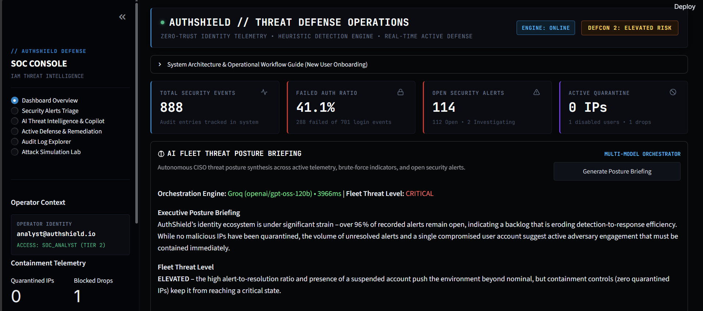
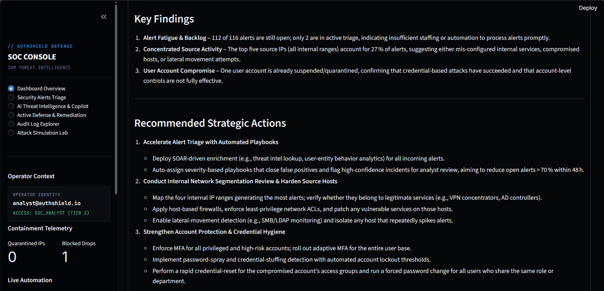
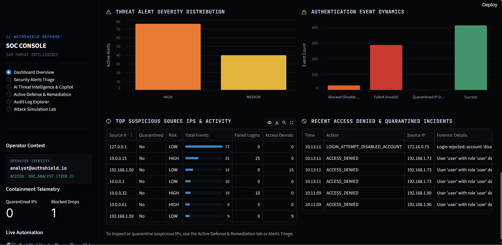
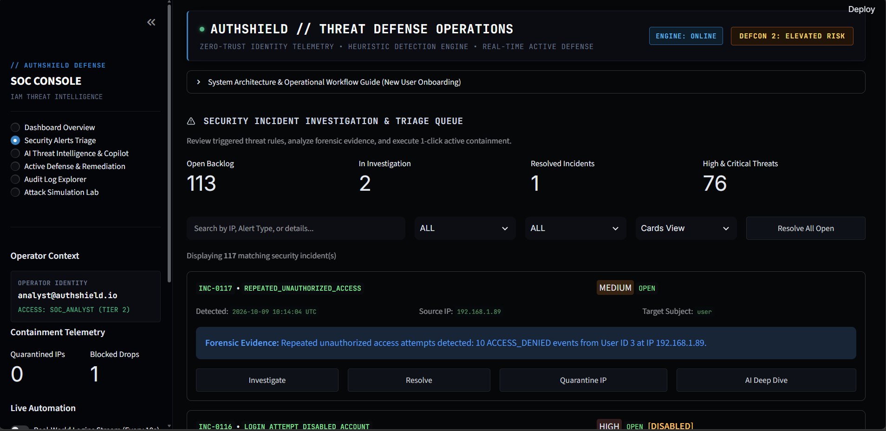
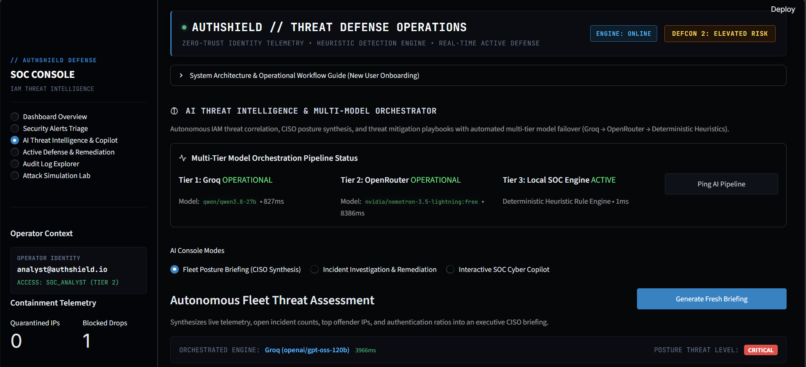
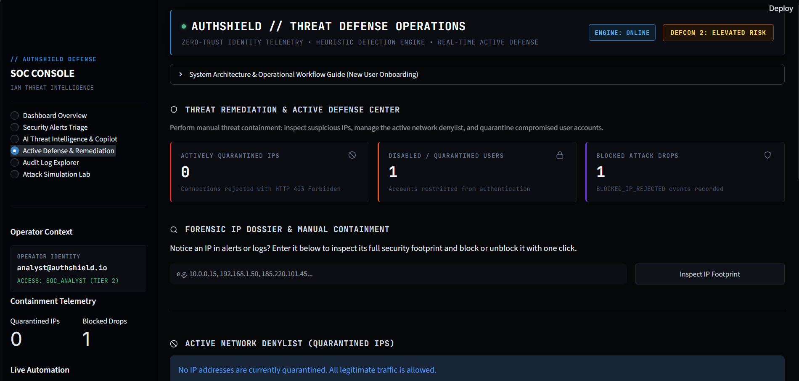
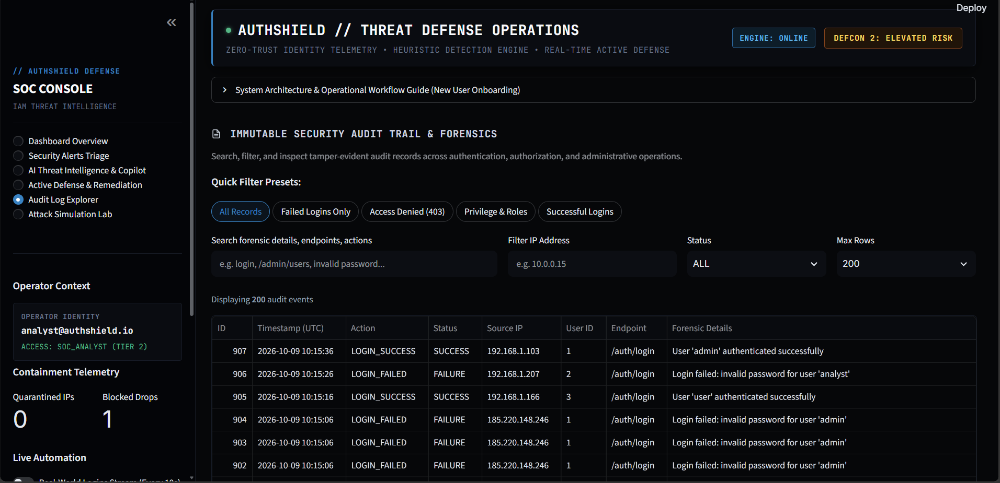
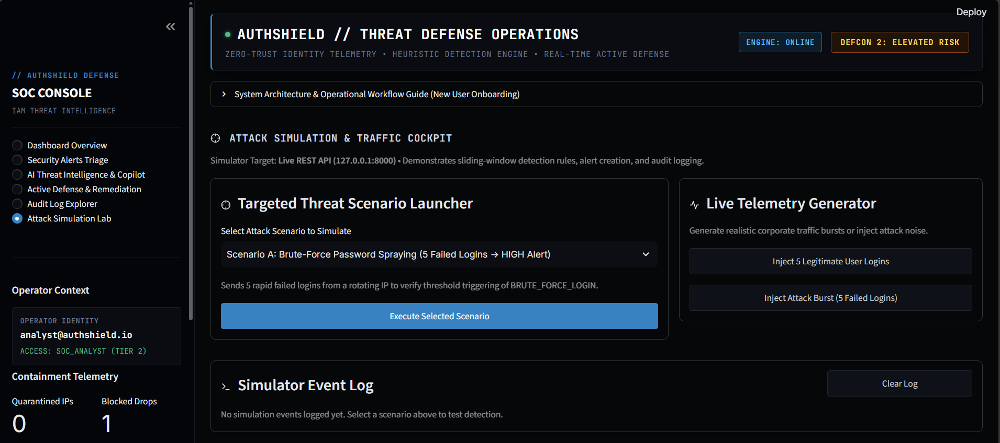

# 📸 AuthShield — Visual Walkthrough & Product Tour

> **A chronological guided visual tour of the AuthShield Security Operations Center (SOC) dashboard, detection telemetry, incident triage queues, multi-model AI threat intelligence, active containment controls, and attack simulation cockpit.**

**Documentation Hub:** [📖 Root README](../README.md) • [🚀 Run Guide](RUN_GUIDE.md) • [🧬 Logical Flow](../LOGICAL_FLOW.md) • [💼 Business Flow](project_business_flow.md) • [📋 PRD Specification](PRD.txt)

---

## 🗺️ Tour Itinerary

This visual tour presents the platform in chronological operational sequence across all 8 major dashboard stages:

| Step | Interface & Operational Stage | Capabilities & Live Indicators | Visual Artifact |
| :---: | :--- | :--- | :--- |
| **01** | [**SOC Overview & Hero Telemetry**](#step-1-soc-overview--live-telemetry) | Live DEFCON 2 threat level, 4 KPI cards, AI fleet posture briefing | [`01_dashboard_overview_telemetry.png`](#step-1-soc-overview--live-telemetry) |
| **02** | [**AI Threat Briefing & Strategic Actions**](#step-2-ai-ciso-threat-briefing--strategic-actions) | Autonomous CISO key findings, root cause analysis, prioritized remediations | [`02_ai_threat_posture_ciso_briefing.png`](#step-2-ai-ciso-threat-briefing--strategic-actions) |
| **03** | [**Forensic Charts & Attack Dynamics**](#step-3-forensic-visualizations--attack-dynamics) | Altair severity distribution, auth event dynamics, top suspicious source IPs | [`03_forensic_charts_severity_dynamics.png`](#step-3-forensic-visualizations--attack-dynamics) |
| **04** | [**Security Incident Triage Queue**](#step-4-security-incident-investigation--triage-queue) | Incident backlog counters, filter controls, interactive cards with 1-click actions | [`04_security_alerts_triage_queue.png`](#step-4-security-incident-investigation--triage-queue) |
| **05** | [**Multi-Tier AI Orchestration Console**](#step-5-ai-threat-intelligence--multi-tier-model-pipeline) | 3-tier model status (Groq 827ms $\rightarrow$ OpenRouter $\rightarrow$ Local Heuristics 1ms) | [`05_ai_threat_intelligence_orchestrator.png`](#step-5-ai-threat-intelligence--multi-tier-model-pipeline) |
| **06** | [**Active Threat Containment Center**](#step-6-active-defense--perimeter-containment-center) | Forensic IP dossier lookup, network denylist quarantine, user account lockout | [`06_active_defense_threat_containment.png`](#step-6-active-defense--perimeter-containment-center) |
| **07** | [**Forensic Audit Trail Explorer**](#step-7-forensic-audit-trail--tamper-evident-logs) | Tamper-evident audit logs, 1-click filter preset pills, forensic search, CSV export | [`07_audit_log_forensic_explorer.png`](#step-7-forensic-audit-trail--tamper-evident-logs) |
| **08** | [**Attack Simulation Lab & Cockpit**](#step-8-attack-simulation-lab--traffic-cockpit) | 5 targeted threat scenarios, live traffic stream generator, execution logs | [`08_attack_simulation_traffic_cockpit.png`](#step-8-attack-simulation-lab--traffic-cockpit) |

---

## Step 1: SOC Overview & Live Telemetry

> **Console Tab:** `Dashboard Overview` *(Top Section)*  
> **Image File:** `01_dashboard_overview_telemetry.png`

### Key Capabilities Displayed:
1. **Top Header & Dynamic DEFCON Indicator**:
   - `ENGINE: ONLINE` confirms sliding-window heuristic detection is active.
   - `DEFCON 2: ELEVATED RISK` highlights active threat volume across the environment.
2. **Hero KPI Cards**:
   - **Total Security Events (`888`)**: Cumulative audit records tracked in the database.
   - **Failed Auth Ratio (`41.1%`)**: Highlighted in red (`kpi-accent-red`) because failed attempts (288 of 701) exceed the 25% threshold, indicating credential guessing.
   - **Open Security Alerts (`114`)**: 112 Open and 2 Investigating incidents in the backlog.
   - **Active Quarantine (`0 IPs`)**: Shows 1 disabled user account and 1 dropped connection attempt.
3. **AI Fleet Threat Posture Briefing**:
   - Synthesized live via `Groq (openai/gpt-oss-120b)` in **3966ms**.
   - Evaluates fleet threat level as `ELEVATED` due to the alert-to-resolution ratio and active compromised account.
4. **Sidebar Operator Context**:
   - Authenticated operator stamped as `analyst@authshield.io` (`SOC_ANALYST (TIER 2)`).

---

## Step 2: AI CISO Threat Briefing & Strategic Actions

> **Console Tab:** `Dashboard Overview` *(Middle Section)*  
> **Image File:** `02_ai_threat_posture_ciso_briefing.png`

### Key Capabilities Displayed:
1. **Autonomous Key Findings**:
   - **Alert Fatigue & Backlog**: 112 of 116 alerts remain unhandled, pinpointing triage bottlenecks.
   - **Concentrated Source Activity**: Top five internal IPs generate 27% of total alerts, indicating compromised internal hosts or lateral probing.
   - **User Account Compromise**: Confirms credential attack success resulting in user suspension.
2. **Recommended Strategic Actions**:
   - **Accelerate Triage**: Deploy SOAR-driven enrichment to reduce backlog by >70% within 48 hours.
   - **Network Segmentation**: Isolate top offending internal IP subnets and enforce least-privilege ACLs.
   - **Credential Hygiene**: Enforce adaptive Multi-Factor Authentication (MFA) and initiate password resets.

---

## Step 3: Forensic Visualizations & Attack Dynamics

> **Console Tab:** `Dashboard Overview` *(Bottom Section)*  
> **Image File:** `03_forensic_charts_severity_dynamics.png`

### Key Capabilities Displayed:
1. **Threat Alert Severity Distribution (Altair Chart)**:
   - Visual breakdown showing ~76 `HIGH` severity alerts (orange) and ~40 `MEDIUM` severity alerts (yellow).
2. **Authentication Event Dynamics (Altair Chart)**:
   - High-contrast visual distribution comparing **Success** (~410 green), **Failed (Invalid)** (~288 red), **Blocked (Disabled User)** (~25 orange), and **Quarantined IP Drop** (dark maroon).
3. **Top Suspicious Source IPs & Activity Table**:
   - Ranks top offending hosts with dynamic progress bars (`127.0.0.1`, `10.0.0.15`, `192.168.1.50`, etc.).
   - Computes risk ratings (`HIGH`, `LOW`) and tallies failed logins vs. access denials per host.
4. **Recent Access Denied & Quarantined Incidents Feed**:
   - Live stream of recent security violations (`LOGIN_ATTEMPT_DISABLED_ACCOUNT`, `ACCESS_DENIED`) with timestamps and target endpoints.

---

## Step 4: Security Incident Investigation & Triage Queue

> **Console Tab:** `Security Alerts Triage`  
> **Image File:** `04_security_alerts_triage_queue.png`

### Key Capabilities Displayed:
1. **Triage Summary Counters**:
   - **Open Backlog (`113`)**, **In Investigation (`2`)**, **Resolved Incidents (`1`)**, **High & Critical Threats (`76`)**.
2. **Unified Search & Filter Bar**:
   - Instant text search, status selector, severity selector, view mode switch (`Cards View` vs. `Table View`), and a 1-click **Resolve All Open** action.
3. **Interactive Incident Action Cards**:
   - `INC-0117`: `REPEATED_UNAUTHORIZED_ACCESS` (Severity: `MEDIUM`, Status: `OPEN`, Source IP: `192.168.1.89`, Target: `user`).
   - Detailed forensic evidence: *Repeated unauthorized access attempts detected: 10 ACCESS_DENIED events from User ID 3*.
   - Direct 1-click action buttons: `Investigate`, `Resolve`, `Quarantine IP`, and `AI Deep Dive`.
   - `INC-0116`: `LOGIN_ATTEMPT_DISABLED_ACCOUNT` marked with the `[DISABLED]` badge.

---

## Step 5: AI Threat Intelligence & Multi-Tier Model Pipeline

> **Console Tab:** `AI Threat Intelligence & Copilot`  
> **Image File:** `05_ai_threat_intelligence_orchestrator.png`

### Key Capabilities Displayed:
1. **Multi-Tier Model Orchestration Pipeline Status**:
   - **Tier 1 (Groq)**: `OPERATIONAL` using `qwen/qwen3.8-27b` with ultra-low latency (**827ms**).
   - **Tier 2 (OpenRouter)**: `OPERATIONAL` using `nvidia/nemotron-3.5-lightning:free` (**8386ms**).
   - **Tier 3 (Local SOC Engine)**: `ACTIVE` using `authshield-rule-heuristics-v1` (**1ms** offline).
   - **Ping AI Pipeline Button**: Live health-check probe for all inference endpoints.
2. **AI Console Modes**:
   - Toggle between **Fleet Posture Briefing (CISO Synthesis)**, **Incident Investigation & Remediation**, and **Interactive SOC Cyber Copilot**.
3. **Autonomous Fleet Threat Assessment**:
   - Real-time CISO evaluation with direct engine telemetry attribution (`Groq (openai/gpt-oss-120b) 3966ms`).

---

## Step 6: Active Defense & Perimeter Containment Center

> **Console Tab:** `Active Defense & Remediation`  
> **Image File:** `06_active_defense_threat_containment.png`

### Key Capabilities Displayed:
1. **Containment Telemetry KPIs**:
   - **Actively Quarantined IPs (`0`)**: Enforcing immediate HTTP 403 blocks on network ingress.
   - **Disabled / Quarantined Users (`1`)**: Suspended accounts prevented from authenticating.
   - **Blocked Attack Drops (`1`)**: Cumulative requests dropped at the perimeter.
2. **Forensic IP Dossier & Manual Containment**:
   - Fast IP lookup tool allowing analysts to inspect full historical telemetry for any IP and apply immediate quarantine rules.
3. **Active Network Denylist**:
   - Real-time management table showing quarantined IPs, blocking operators, justifications, and 1-click unblock releases.

---

## Step 7: Forensic Audit Trail & Tamper-Evident Logs

> **Console Tab:** `Audit Log Explorer`  
> **Image File:** `07_audit_log_forensic_explorer.png`

### Key Capabilities Displayed:
1. **Quick Filter Preset Pills**:
   - 1-click preset filters: `All Records`, `Failed Logins Only`, `Access Denied (403)`, `Privilege & Roles`, and `Successful Logins`.
2. **Granular Multi-Column Filters**:
   - Freeform search across endpoints, actions, and details; specific IP address filter; HTTP status selector (`SUCCESS`, `FAILURE`, `DENIED`); and row count cap (up to 1,000 rows).
3. **Tamper-Evident Audit Table**:
   - Chronological log entries with ID, UTC timestamp, Action (`LOGIN_SUCCESS`, `LOGIN_FAILED`), Status, Source IP, User ID, Endpoint (`/auth/login`), and detailed forensic evidence strings.

---

## Step 8: Attack Simulation Lab & Traffic Cockpit

> **Console Tab:** `Attack Simulation Lab`  
> **Image File:** `08_attack_simulation_traffic_cockpit.png`

### Key Capabilities Displayed:
1. **Targeted Threat Scenario Launcher**:
   - Dropdown selection supporting 5 real-world IAM attack simulations:
     - **Scenario A**: Brute-Force Password Spraying (5 Failed Logins $\rightarrow$ `HIGH` Alert).
     - **Scenario B**: Normal User Typos (2 Failed Logins $\rightarrow$ Safe Baseline).
     - **Scenario C**: Repeated Unauthorized Access Probe (3x 403 Forbidden $\rightarrow$ `MEDIUM` Alert).
     - **Scenario D**: Administrative Privilege Escalation (Promote to Admin $\rightarrow$ `HIGH` Alert).
     - **Scenario E**: Login on Disabled/Quarantined Account (Terminated User $\rightarrow$ `HIGH` Alert).
   - 1-click **Execute Selected Scenario** trigger.
2. **Live Telemetry Generator**:
   - **Inject 5 Legitimate User Logins**: Seeds realistic employee traffic across office subnets.
   - **Inject Attack Burst (5 Failed Logins)**: Triggers an immediate brute-force threshold breach.
3. **Simulator Event Log Terminal**:
   - Real-time monospace terminal displaying execution requests, HTTP status codes, and generated alert confirmations.

---

## 🧭 Navigation Summary

| Document | Link | Focus |
| :--- | :--- | :--- |
| **Root README** | [README.md](../README.md) | Platform overview, quick start, API reference, and feature summary |
| **Run & Execution Guide** | [RUN_GUIDE.md](RUN_GUIDE.md) | Multi-terminal scripts, seed credentials, setup instructions |
| **Complete Logical Flow** | [LOGICAL_FLOW.md](../LOGICAL_FLOW.md) | Calculations, detection rules, data pipelines, and flowcharts |
| **Real-World Life Flow** | [life_logical_flow.md](life_logical_flow.md) | Human behaviors, supervised vs. unsupervised scenarios |
| **Project & Business Flow** | [project_business_flow.md](project_business_flow.md) | Enterprise value, market fit, personas, and monetization |
| **PRD Specification** | [PRD.txt](PRD.txt) | Detailed engineering requirements and technical specifications |
